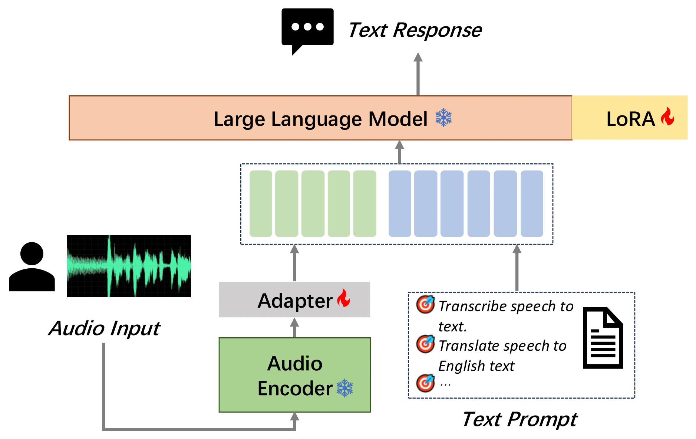

<p align="left">
        <strong>English</strong> &nbsp｜ &nbsp <a href="README_CN.md"><strong>中文</strong></a> &nbsp
</p>
<br><br>

<h1 align="center">MooER (摩耳): Open-sourced LLM for audio understanding trained on 80,000 hours of data </h1>

<div align='center'>
    <a href='https://scholar.google.com/citations?user=eYP4TmgAAAAJ&hl=zh-CN&oi=ao' target='_blank'><u>Zhenlin Liang</u></a><sup>†</sup>&emsp;
    <a href='https://scholar.google.com/citations?user=Yrn4Q1IAAAAJ&hl=zh-CN' target='_blank'>Junhao Xu</a><sup>†</sup>&emsp;
    <a href='http://yiliu.org.cn' target='_blank'><u>Yi Liu</u></a>&emsp;
    <br>
    <a href='' target='_blank'>Yichao Hu</a>&emsp;
    <a href='' target='_blank'>Jian Li</a>&emsp;
    <a href='' target='_blank'>Yajun Zheng</a>&emsp;
    <a href='https://scholar.google.com/citations?hl=zh-CN&user=fTYtreAAAAAJ' target='_blank'><u>Meng Cai</u></a>&emsp;
    <a href='' target='_blank'>Hua Wang</a>&emsp;
</div>

<div align='center'>
    <small><sup>†</sup> equal contribution</small>
</div>


<br>
<div align="center">
  <!-- <a href='LICENSE'></a> -->
  <a href='https://github.com/MooreThreads/MooER'></a>
  <a href='https://arxiv.org/abs/2408.05101'></a>
  <a href='https://mooer-speech.mthreads.com:10077/'></a>
  <br>
  <a href='https://huggingface.co/mtspeech/MooER-MTL-5K'></a>
  <a href='https://huggingface.co/mtspeech/MooER-MTL-80K'></a>
  <a href='https://modelscope.cn/models/MooreThreadsSpeech/MooER-MTL-5K'></a>
  <a href='https://modelscope.cn/models/MooreThreadsSpeech/MooER-MTL-80K'></a>
</div>
<br>

## 🔥 Updates

- **`2024/09/03`**: We have open-sourced the ***training and inference code*** for MooER! You can follow this [tutorial](tutorial/train.md) to train your own audio understanding model and tasks or fine-tune based on our 80k hours model.
- **`2024/08/27`**: We released [MooER-80K-v2](https://modelscope.cn/models/MooreThreadsSpeech/MooER-MTL-80K) which was trained using 80K hours of data. The performance of the new model can be found below. Currently, it only supports the speech recognition task. The speech translation and the multi-task models will be released soon.
- **`2024/08/09`**: We released [a Gradio demo](https://mooer-speech.mthreads.com:10077/) running on Moore Threads S4000.
- **`2024/08/09`**: We released the inference code and the pretrained speech recognition and speech translation (zh->en) models using 5000 hours of data.
- **`2024/08/09`**: We release MooER v0.1 technical report on [arXiv](https://arxiv.org/abs/2408.05101).


## 📝 Roadmap

- [x] Technical report
- [x] Inference code and pretrained ASR/AST models using 5k hours of data
- [x] Pretrained ASR model using 80k hours of data
- [x] Traning code for MooER
- [ ] Pretrained AST and multi-task models using 80k hours of data
- [ ] LLM-based speech-to-speech translation (S2ST, Mandrin Chinese to English)
- [ ] GPT-4o-like audio-LLM supporting chat using speech
- [ ] LLM-based timbre-preserving Speech-to-speech translation

## 📖 Introduction

We introduce **MooER (摩耳)**: an LLM-based speech recognition and translation model developed by Moore Threads. With the *MooER* framework, you can transcribe the speech into text (automatic speech recognition, ASR) and translate the speech into other languages (automatic speech translation, AST) in an LLM-based end-to-end manner. Some of the evaluation results of the *MooER* are presented in the subsequent section. More detailed experiments, along with our insights into model configurations, training strategies, etc, are provided in our [technical report](https://arxiv.org/abs/2408.05101).

We proudly highlight that *MooER* is developed using Moore Threads S4000 GPUs. To the best of our knowledge, **this is the first LLM-based speech model trained and inferred using entirely domestic GPUs.**

> [!Note]
> We are going to release the training code for *MooER*, as well as models trained with more data. Please stay tuned!

<br>
<p align="center">
    
<p>
<br>

## 🥊 Evaluation Results

We present the training data and the evaluation results below. For more comprehensive information, please refer to our [report](https://arxiv.org/pdf/2408.05101).

### Training data

We utilize 5,000 hours of speech data (MT5K) to train our basic *MooER-5K* model. The data sources include:

| Dataset          | Duration          |
|---------------|---------------|
| aishell2 | 137h          |
| librispeech | 131h      |
| multi_cn | 100h          |
| wenetspeech  | 1361h     |
| in-house data | 3274h  |

Note that, data from the open-source datasets were randomly selected from the full training set. The in-house speech data, collected internally without transcription, were transcribed using a third-party ASR service.

Since all the above datasets were originally collected only for the speech recognition task, no translation labels are available. We leveraged a third-party machine translation service to generate pseudo-labels for translation. No data filtering techniques were applied.

At this moment, we are also developing a new model trained with 80,000 hours of speech data.

### Speech Recognition

The performance of speech recognition is evaluated using word error rate (WER) and character error rate (CER).

<table>
  <tr>
    <th>Language</th>
    <th>Testset</th>
    <th>Paraformer-large</th>
    <th>SenseVoice-small</th>
    <th>Qwen-audio</th>
    <th>Whisper-large-v3</th>
    <th>SeamlessM4T-v2</th>
    <th>MooER-5K</th>
    <th>MooER-80K</th>
    <th>MooER-80K-v2</th>
  </tr>
  <tr>
    <td rowspan="7">Chinese</td>
    <td>aishell1</td>
    <td>1.93</td>
    <td>3.03</td>
    <td>1.43</td>
    <td>7.86</td>
    <td>4.09</td>
    <td>1.93</td>
    <td>1.25</td>
    <td>1.00</td>
  </tr>
  <tr>
    <td>aishell2_ios</td>
    <td>2.85</td>
    <td>3.79</td>
    <td>3.57</td>
    <td>5.38</td>
    <td>4.81</td>
    <td>3.17</td>
    <td>2.67</td>
    <td>2.62</td>
  </tr>
  <tr>
    <td>test_magicdata</td>
    <td>3.66</td>
    <td>3.81</td>
    <td>5.31</td>
    <td>8.36</td>
    <td>9.69</td>
    <td>3.48</td>
    <td>2.52</td>
    <td>2.17</td>
  </tr>
  <tr>
    <td>test_thchs</td>
    <td>3.99</td>
    <td>5.17</td>
    <td>4.86</td>
    <td>9.06</td>
    <td>7.14</td>
    <td>4.11</td>
    <td>3.14</td>
    <td>3.00</td>
  </tr>
  <tr>
    <td>fleurs cmn_dev</td>
    <td>5.56</td>
    <td>6.39</td>
    <td>10.54</td>
    <td>4.54</td>
    <td>7.12</td>
    <td>5.81</td>
    <td>5.23</td>
    <td>5.15</td>
  </tr>
  <tr>
    <td>fleurs cmn_test</td>
    <td>6.92</td>
    <td>7.36</td>
    <td>11.07</td>
    <td>5.24</td>
    <td>7.66</td>
    <td>6.77</td>
    <td>6.18</td>
    <td>6.14</td>
  </tr>
  <tr>
    <td>average</td>
    <td><strong>4.15</strong></td>
    <td><strong>4.93</strong></td>
    <td><strong>6.13</strong></td>
    <td><strong>6.74</strong></td>
    <td><strong>6.75</strong></td>
    <td><strong>4.21</strong></td>
    <td><strong>3.50</strong></td>
    <td><strong>3.35</strong></td>
  </tr>
  <tr>
    <td rowspan="7">English</td>
    <td>librispeech test_clean</td>
    <td>14.15</td>
    <td>4.07</td>
    <td>2.15</td>
    <td>3.42</td>
    <td>2.77</td>
    <td>7.78</td>
    <td>4.11</td>
    <td>3.57</td>
  </tr>
  <tr>
    <td>librispeech test_other</td>
    <td>22.99</td>
    <td>8.26</td>
    <td>4.68</td>
    <td>5.62</td>
    <td>5.25</td>
    <td>15.25</td>
    <td>9.99</td>
    <td>9.09</td>
  </tr>
  <tr>
    <td>fleurs eng_dev</td>
    <td>24.93</td>
    <td>12.92</td>
    <td>22.53</td>
    <td>11.63</td>
    <td>11.36</td>
    <td>18.89</td>
    <td>13.32</td>
    <td>13.12</td>
  </tr>
  <tr>
    <td>fleurs eng_test</td>
    <td>26.81</td>
    <td>13.41</td>
    <td>22.51</td>
    <td>12.57</td>
    <td>11.82</td>
    <td>20.41</td>
    <td>14.97</td>
    <td>14.74</td>
  </tr>
  <tr>
    <td>gigaspeech dev</td>
    <td>24.23</td>
    <td>19.44</td>
    <td>12.96</td>
    <td>19.18</td>
    <td>28.01</td>
    <td>23.46</td>
    <td>16.92</td>
    <td>17.34</td>
  </tr>
  <tr>
    <td>gigaspeech test</td>
    <td>23.07</td>
    <td>16.65</td>
    <td>13.26</td>
    <td>22.34</td>
    <td>28.65</td>
    <td>22.09</td>
    <td>16.64</td>
    <td>16.97</td>
  </tr>
  <tr>
    <td>average</td>
    <td><strong>22.70</strong></td>
    <td><strong>12.46</strong></td>
    <td><strong>13.02</strong></td>
    <td><strong>12.46</strong></td>
    <td><strong>14.64</strong></td>
    <td><strong>17.98</strong></td>
    <td><strong>12.66</strong></td>
    <td><strong>12.47</strong></td>
  </tr>
</table>

### Speech Translation (zh -> en)

For speech translation, the performance is evaluated using BLEU score.

| Testset | Speech-LLaMA | Whisper-large-v3 | Qwen-audio | Qwen2-audio | SeamlessM4T-v2 | MooER-5K | MooER-5K-MTL |
|--------|-------------|-------------------|------------|-------------|-----------------|--------|--------------|
|CoVoST1 zh2en | - |  13.5 | 13.5 | - | 25.3 | - | **30.2** |
|CoVoST2 zh2en | 12.3 | 12.2 | 15.7 | 24.4 | 22.2 | 23.4 | **25.2** |
|CCMT2019 dev | -  | 15.9 | 12.0 | - | 14.8 | - | **19.6** |


## 🏁 Getting Started

### 🛠️ Build Environtment

Currently, only Linux is supported. Ensure that [`git`](https://git-scm.com/) and `python` are installed on your system. We recommend Python version `>=3.8`. It is highly recommanded to install [`conda`](https://anaconda.org/anaconda/conda) to create a virtual environment.

For efficient LLM inference, GPUs should be used. For Moore Threads S3000/S4000 users, please install [MUSA toolkit rc2.1.0](https://developer.mthreads.com/sdk/download/musa?equipment=&os=&driverVersion=&version=). A docker image is also available for S4000 users. If you use other GPUs, install your own drivers/toolkits (e.g. cuda).

Build the environment with the following steps:

```shell
git clone https://github.com/MooreThreads/MooER
cd MooER

# (optional) create env using conda
conda create -n mooer python=3.8
conda activate mooer

# install the dependencies
apt update
apt install ffmpeg sox
pip install -r requirements.txt
```

Docker image usage for Moore Threads S4000 users is provided:

```shell
sudo docker run -it \
    --privileged \
    --name=torch_musa_release \
    --env MTHREADS_VISIBLE_DEVICES=all \
    -p 10010:10010 \
    --shm-size 80g \
    --ulimit memlock=-1 \
    mtspeech/mooer:v1.0-rc2.1.0-v1.1.0-qy2 \
    /bin/bash

# If you are nvidia user, you can try this image with cuda 11.7
sudo docker run -it \
    --privileged \
    --gpus all \
    -p 10010:10010 \
    --shm-size 80g \
    --ulimit memlock=-1 \
    mtspeech/mooer:v1.0-cuda11.7-cudnn8 \
    /bin/bash
```

### 💾 Download Pretrained Models

First, download the pretrained models from [ModelScope](https://modelscope.cn/models/MooreThreadsSpeech/MooER-MTL-5K) or [HuggingFace](https://huggingface.co/mtspeech/MooER-MTL-5K).

```shell
# use modelscope
git lfs clone https://modelscope.cn/models/MooreThreadsSpeech/MooER-MTL-5K

# use huggingface
git lfs clone https://huggingface.co/mtspeech/MooER-MTL-5K
```

Put the downloaded files in `pretrained_models`

```shell
cp MooER-MTL-5K/* pretrained_models
```

Then, download [`Qwen2-7B-Instruct`](https://modelscope.cn/models/qwen/qwen2-7b-instruct) by:

```shell
# use modelscope
git lfs clone https://modelscope.cn/models/qwen/qwen2-7b-instruct

# use huggingface
git lfs clone https://huggingface.co/Qwen/Qwen2-7B-Instruct
```

Put the downloaded files into `pretrained_models/Qwen2-7B-Instruct`.

Finally, all these files should be orgnized as follows. The md5sum's are also provided.

```text
./pretrained_models/
|-- paraformer_encoder
|   |-- am.mvn                           # dc1dbdeeb8961f012161cfce31eaacaf
|   `-- paraformer-encoder.pth           # 2ef398e80f9f3e87860df0451e82caa9
|-- asr
|   |-- adapter_project.pt               # 2462122fb1655c97d3396f8de238c7ed
|   `-- lora_weights
|       |-- README.md
|       |-- adapter_config.json          # 8a76aab1f830be138db491fe361661e6
|       `-- adapter_model.bin            # 0fe7a36de164ebe1fc27500bc06c8811
|-- ast
|   |-- adapter_project.pt               # 65c05305382af0b28964ac3d65121667
|   `-- lora_weights
|       |-- README.md
|       |-- adapter_config.json          # 8a76aab1f830be138db491fe361661e6
|       `-- adapter_model.bin            # 12c51badbe57298070f51902abf94cd4
|-- asr_ast_mtl
|   |-- adapter_project.pt               # 83195d39d299f3b39d1d7ddebce02ef6
|   `-- lora_weights
|       |-- README.md
|       |-- adapter_config.json          # 8a76aab1f830be138db491fe361661e6
|       `-- adapter_model.bin            # a0f730e6ddd3231322b008e2339ed579
|-- Qwen2-7B-Instruct
|   |-- model-00001-of-00004.safetensors # d29bf5c5f667257e9098e3ff4eec4a02
|   |-- model-00002-of-00004.safetensors # 75d33ab77aba9e9bd856f3674facbd17
|   |-- model-00003-of-00004.safetensors # bc941028b7343428a9eb0514eee580a3
|   |-- model-00004-of-00004.safetensors # 07eddec240f1d81a91ca13eb51eb7af3
|   |-- model.safetensors.index.json
|   |-- config.json                      # 8d67a66d57d35dc7a907f73303486f4e
|   |-- configuration.json               # 040f5895a7c8ae7cf58c622e3fcc1ba5
|   |-- generation_config.json           # 5949a57de5fd3148ac75a187c8daec7e
|   |-- merges.txt                       # e78882c2e224a75fa8180ec610bae243
|   |-- tokenizer.json                   # 1c74fd33061313fafc6e2561d1ac3164
|   |-- tokenizer_config.json            # 5c05592e1adbcf63503fadfe429fb4cc
|   |-- vocab.json                       # 613b8e4a622c4a2c90e9e1245fc540d6
|   |-- LICENSE
|   `-- README.md
|-- README.md
`-- configuration.json
```

#### Update [2024/08/27]

The new *MooER-80K-v2* is released. You can download the new model and update `pretrained_models`.

```shell
# use modelscope
git lfs clone https://modelscope.cn/models/MooreThreadsSpeech/MooER-MTL-80K

# use huggingface
git lfs clone https://huggingface.co/mtspeech/MooER-MTL-80K
```

The md5sum's of the updated files are provided.

```text
./pretrained_models/
`-- asr
    |-- adapter_project.pt               # af9022e2853f9785cab49017a18de82c
    `-- lora_weights
        |-- README.md
        |-- adapter_config.json          # ad3e3bfe9447b808b9cc16233ffacaaf
        `-- adapter_model.bin            # 3c22b9895859b01efe49b017e8ed6ec7
```


## 🏋️ Training

**We have open-sourced the training and inference code for MooER! You can follow this [tutorial](tutorial/train.md) to train your own audio understanding model or fine-tune based on 80k hours model.**

## 🚀 Inference

You can simply run the inference example to get the idea.

```shell
# set environment variables
export PYTHONIOENCODING=UTF-8
export LC_ALL=C
export PYTHONPATH=$PWD/src:$PYTHONPATH

# do inference
python inference.py
```

The script runs a multi-task model that will output the speech recognition and translation results simultaneously. If it runs successfully, you will get the ASR and AST results from the terminal.

You can specify your own audio files and change the model settings.

```shell
# use your own audio file
python inference.py --wav_path /path/to/your_audio_file

# an scp file is also supported. The format of each line is: "uttid wav_path":
# test1 my_test_audio1.wav
# test2 my_test_audio2.wav
# ...
python inference.py --wav_scp /path/to/your_wav_scp

# change to an ASR model (only transcription)
python inference.py --task asr \
    --cmvn_path pretrained_models/paraformer_encoder/am.mvn \
    --encoder_path pretrained_models/paraformer_encoder/paraformer-encoder.pth \
    --llm_path pretrained_models/Qwen2-7B-Instruct \
    --adapter_path pretrained_models/asr/adapter_project.pt \
    --lora_dir pretrained_models/asr/lora_weights \
    --wav_path /path/to/your_audio_file

# change to an AST model (only translation)
python inference.py --task ast \
    --cmvn_path pretrained_models/paraformer_encoder/am.mvn \
    --encoder_path pretrained_models/paraformer_encoder/paraformer-encoder.pth \
    --llm_path pretrained_models/Qwen2-7B-Instruct \
    --adapter_path pretrained_models/ast/adapter_project.pt \
    --lora_dir pretrained_models/ast/lora_weights \
    --wav_path /path/to/your_audio_file

# Note: set `--task ast` if you want to use the asr/ast multitask model
# show all the parameters
python inference.py -h
```

We recommend to use an audio file shorter than 30s. The text in the audio should be less than 500 characters. It is also suggested that you convert the audio to a 16kHz 16bit mono WAV format before processing it (using `ffmpeg` or `sox`).

## 🎨 Gradio Demo

We provide a Gradio interface for a better experience. To use it, run the following commands:

```shell
# set the environment variables
export PYTHONPATH=$PWD/src:$PYTHONPATH

# Run the ASR/AST multitask model
python demo/app.py

# Run the ASR-only model
python demo/app.py \
  --task asr \
  --adapter_path pretrained_models/asr/adapter_project.pt \
  --lora_dir pretrained_models/asr/lora_weights

# Run the AST-only model
python demo/app.py \
  --task ast \
  --adapter_path pretrained_models/ast/adapter_project.pt \
  --lora_dir pretrained_models/ast/lora_weights
```

You can specify `--server_port`, `--share`, `--server_name` as needed.

Due to the lack of an HTTPS certificate, your access is limited to HTTP, for which modern browsers block the microphone access. As a workaround, you can manually grant access. For instance, in Chrome, navigate to `chrome://flags/#unsafely-treat-insecure-origin-as-secure` and add the target address to the whitelist. For other browsers, please google for a similar workaround.

In the demo, using the streaming mode will yield faster results. However, please note that the beam size is restricted to be 1 in the streaming mode, which may slightly degrade the performance.

> 🤔 No experience about how to run Gradio?
>
> 💻 Don't have a machine to run the demo?
>
> ⌛ Don't have time to install the dependencies?
>
> **☕ Just take a coffee and click [here to try our online demo](https://mooer-speech.mthreads.com:10077/). It is running on a Moore Threads S4000 GPU server!**


## License

Please see the [LICENSE](LICENSE.md).


## 🙏🏻 Acknowledgements

We borrowed the speech encoder from [FunASR](https://github.com/modelscope/FunASR).

The LLM code was borrowed from [Qwen2](https://github.com/QwenLM/Qwen2).

Our training and inference codes are adapted from [SLAM-LLM](https://github.com/X-LANCE/SLAM-LLM) and [Wenet](https://github.com/wenet-e2e/wenet).

We also got inspiration from other open-source repositories like [whisper](https://github.com/openai/whisper) and [SeamlessM4T](https://github.com/facebookresearch/seamless_communication). We would like to thank all the authors and contributors for their innovative ideas and codes.

## 💖 Citation

If you find MooER useful for your research, please 🌟 this repo and cite our work using the following BibTeX:

```bibtex
@article{liang2024mooer,
  title   = {MooER: LLM-based Speech Recognition and Translation Models from Moore Threads},
  author  = {Zhenlin Liang, Junhao Xu, Yi Liu, Yichao Hu, Jian Li, Yajun Zheng, Meng Cai, Hua Wang},
  journal = {arXiv preprint arXiv:2408.05101},
  year    = {2024}
}
```

## 📧 Contact

If you encouter any problems, feel free to create an issue.

Moore Threads Website: **https://www.mthreads.com/**

<br>
<p align="left">
    
<p>
<br>
