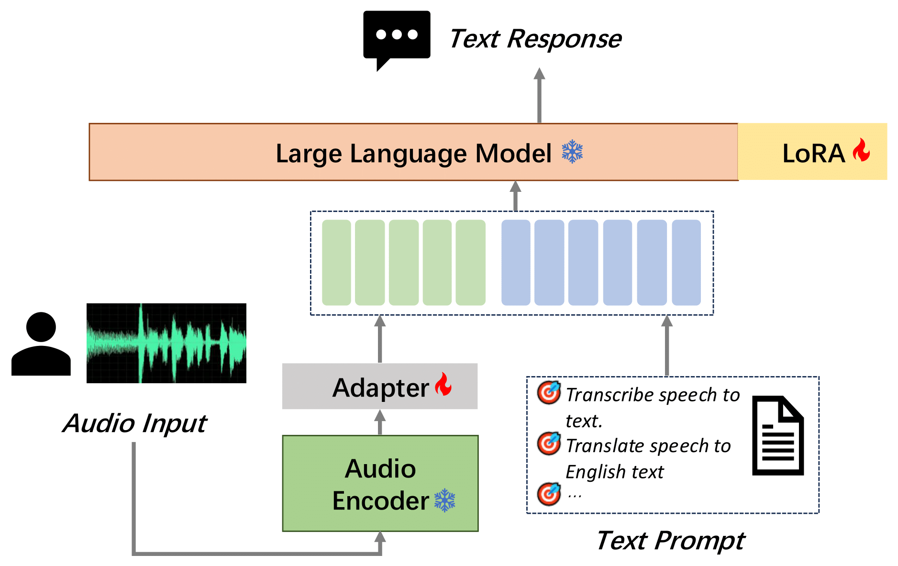

<p align="left">
        <strong>中文</strong> &nbsp｜ &nbsp <a href="README.md"><strong>English</strong></a> &nbsp
</p>
<br><br>

<h1 align="center">MooER (摩耳): 基于大语言模型的语音识别与语音翻译系统 </h1>

<div align='center'>
    <a href='https://scholar.google.com/citations?user=eYP4TmgAAAAJ&hl=zh-CN&oi=ao' target='_blank'><u>梁镇麟</u></a><sup>†</sup>&emsp;
    <a href='https://scholar.google.com/citations?user=Yrn4Q1IAAAAJ&hl=zh-CN' target='_blank'>许隽昊</a><sup>†</sup>&emsp;
    <a href='http://yiliu.org.cn' target='_blank'><u>刘艺</u></a>&emsp;
    <br>
    <a href='' target='_blank'>胡一超</a>&emsp;
    <a href='' target='_blank'>黎健</a>&emsp;
    <a href='' target='_blank'>郑亚军</a>&emsp;
    <a href='https://scholar.google.com/citations?hl=zh-CN&user=fTYtreAAAAAJ' target='_blank'><u>蔡猛</u></a>&emsp;
    <a href='' target='_blank'>王华</a>&emsp;
</div>

<div align='center'>
    <small><sup>†</sup> 共同一作</small>
</div>


<br>
<div align="center">
  <!-- <a href='LICENSE'></a> -->
  <a href='https://github.com/MooreThreads/MooER'></a>
  <a href='https://arxiv.org/abs/2408.05101'></a>
  <a href='https://mooer-speech.mthreads.com:10077/'></a>
  <a href='https://huggingface.co/mtspeech/MooER-MTL-5K'></a>
  <a href='https://modelscope.cn/models/MooreThreadsSpeech/MooER-MTL-5K'></a>
</div>
<br>

## 🔥 更新

- **`2024/08/09`**: 我们推出了[基于Gradio的在线演示](https://mooer-speech.mthreads.com:10077/)。该演示系统运行在摩尔线程S4000服务器上。
- **`2024/08/09`**: 我们开源了推理代码，并同时开放了多个基于5000小时数据训练的语音识别及语音翻译（中->英）模型。欢迎试用！
- **`2024/08/09`**: 我们在arXiv上发布了 MooER v0.1 的[技术报告](https://arxiv.org/abs/2408.05101).


## 📖 介绍

在本工作中，我们推出了**摩耳大模型（英文名：MooER）**—— 一个由摩尔线程开发的、基于大语言模型（Large Language Model，LLM）的语音识别和语音翻译系统。通过摩耳框架，您可以基于大语言模型，以端到端的方式，将输入语音自动转录为文本（即*语音识别*），并将其翻译为其它语言（即*语音翻译*）。关于MooER的具体效果，您可以查阅下文中有关*评测结果*的部分。在我们公布的[技术报告](https://arxiv.org/abs/2408.05101)中，我们提供了更详细的实验结果，并分享了我们对模型配置、训练策略等方面的理解。

我们自豪地指出，我们开源摩耳大模型完全采用摩尔线程S4000 GPU开发。**据我们所知，这是目前第一个完全使用国产GPU训练和推理的语音大模型。**

> [!note]
> 我们近期即将发布摩耳大模型的训练代码，并开源使用更大量数据训练的模型。敬请关注！

<br>
<p align="center">
    
<p>
<br>

## 🥊 评测结果

此部分展示了我们使用的训练集和评测结果。更多其它信息，请参考我们的[技术报告](https://arxiv.org/pdf/2408.05101)。

### 训练数据

我们使用5000小时数据（我们称之为MT5K），用于训练我们的初版摩耳大模型。这些数据组成如下：

| 数据集          | 时长（小时）          |
|---------------|---------------|
| aishell2 | 137          |
| librispeech | 131      |
| multi_cn | 100          |
| wenetspeech  | 1361     |
| in-house data | 3274  |

需要注意的是，MT5K中使用的开源数据，是从完整开源数据集中随机选择的子集。由于我们内部收集的数据只有音频，没有对应文本，因此我们采用第三方提供的语音识别（ASR）服务，自动生成文本标签。

由于上述所有数据集均是针对语音识别任务设计的，因此没有可用的翻译标签（即对应的英文文本）。为了让模型具有翻译能力，我们采用第三方提供的机器翻译服务，自动生成翻译标签。为了尽可能简化数据采集流程，在整个数据处理过程中，我们没有使用任何数据过滤技术。

除了以上5000小时数据外，我们正在使用80000小时数据进行更大规模摩耳大模型的训练。


### 语音识别效果

语音识别效果采用词错误率（Word Error Rate，WER）或字错误率（Character Error Rate，CER）表示。

<table>
  <tr>
    <th>Language</th>
    <th>Testset</th>
    <th>Paraformer-large</th>
    <th>SenseVoice-small</th>
    <th>Qwen-audio</th>
    <th>Whisper-large-v3</th>
    <th>SeamlessM4T-v2</th>
    <th>MooER-5K</th>
    <th>MooER-80K</th>
  </tr>
  <tr>
    <td rowspan="7">Chinese</td>
    <td>aishell1</td>
    <td>1.93</td>
    <td>3.03</td>
    <td>1.43</td>
    <td>7.86</td>
    <td>4.09</td>
    <td>1.93</td>
    <td>1.25</td>
  </tr>
  <tr>
    <td>aishell2_ios</td>
    <td>2.85</td>
    <td>3.79</td>
    <td>3.57</td>
    <td>5.38</td>
    <td>4.81</td>
    <td>3.17</td>
    <td>2.67</td>
  </tr>
  <tr>
    <td>test_magicdata</td>
    <td>3.66</td>
    <td>3.81</td>
    <td>5.31</td>
    <td>8.36</td>
    <td>9.69</td>
    <td>3.48</td>
    <td>2.52</td>
  </tr>
  <tr>
    <td>test_thchs</td>
    <td>3.99</td>
    <td>5.17</td>
    <td>4.86</td>
    <td>9.06</td>
    <td>7.14</td>
    <td>4.11</td>
    <td>3.14</td>
  </tr>
  <tr>
    <td>fleurs cmn_dev</td>
    <td>5.56</td>
    <td>6.39</td>
    <td>10.54</td>
    <td>4.54</td>
    <td>7.12</td>
    <td>5.81</td>
    <td>5.23</td>
  </tr>
  <tr>
    <td>fleurs cmn_test</td>
    <td>6.92</td>
    <td>7.36</td>
    <td>11.07</td>
    <td>5.24</td>
    <td>7.66</td>
    <td>6.77</td>
    <td>6.18</td>
  </tr>
  <tr>
    <td>average</td>
    <td><strong>4.15</strong></td>
    <td><strong>4.93</strong></td>
    <td><strong>6.13</strong></td>
    <td><strong>6.74</strong></td>
    <td><strong>6.75</strong></td>
    <td><strong>4.21</strong></td>
    <td><strong>3.50</strong></td>
  </tr>
  <tr>
    <td rowspan="7">English</td>
    <td>librispeech test_clean</td>
    <td>14.15</td>
    <td>4.07</td>
    <td>2.15</td>
    <td>3.42</td>
    <td>2.77</td>
    <td>7.78</td>
    <td>4.11</td>
  </tr>
  <tr>
    <td>librispeech test_other</td>
    <td>22.99</td>
    <td>8.26</td>
    <td>4.68</td>
    <td>5.62</td>
    <td>5.25</td>
    <td>15.25</td>
    <td>9.99</td>
  </tr>
  <tr>
    <td>fleurs eng_dev</td>
    <td>24.93</td>
    <td>12.92</td>
    <td>22.53</td>
    <td>11.63</td>
    <td>11.36</td>
    <td>18.89</td>
    <td>13.32</td>
  </tr>
  <tr>
    <td>fleurs eng_test</td>
    <td>26.81</td>
    <td>13.41</td>
    <td>22.51</td>
    <td>12.57</td>
    <td>11.82</td>
    <td>20.41</td>
    <td>14.97</td>
  </tr>
  <tr>
    <td>gigaspeech dev</td>
    <td>24.23</td>
    <td>19.44</td>
    <td>12.96</td>
    <td>19.18</td>
    <td>28.01</td>
    <td>23.46</td>
    <td>16.92</td>
  </tr>
  <tr>
    <td>gigaspeech test</td>
    <td>23.07</td>
    <td>16.65</td>
    <td>13.26</td>
    <td>22.34</td>
    <td>28.65</td>
    <td>22.09</td>
    <td>16.64</td>
  </tr>
  <tr>
    <td>average</td>
    <td><strong>22.70</strong></td>
    <td><strong>12.46</strong></td>
    <td><strong>13.02</strong></td>
    <td><strong>12.46</strong></td>
    <td><strong>14.64</strong></td>
    <td><strong>17.98</strong></td>
    <td><strong>12.66</strong></td>
  </tr>
</table>

### 语音翻译效果 (中翻英)

语音翻译效果采用BLEU分数表示。

| Testset | Speech-LLaMA | Whisper-large-v3 | Qwen-audio | Qwen2-audio | SeamlessM4T-v2 | MooER-5K | MooER-5K-MTL |
|--------|-------------|-------------------|------------|-------------|-----------------|--------|--------------|
|CoVoST1 zh2en | - |  13.5 | 13.5 | - | 25.3 | - | **30.2** |
|CoVoST2 zh2en | 12.3 | 12.2 | 15.7 | 24.4 | 22.2 | 23.4 | **25.2** |
|CCMT2019 dev | -  | 15.9 | 12.0 | - | 14.8 | - | **19.6** |


## 🏁 使用指南

### 🛠️ 环境搭建

目前，摩耳仅支持Linux系统。请确保您的系统已经安装了[`git`](https://git-scm.com/) and `python`。我们推荐使用 `>=3.8` 的Python版本。另外，我们强烈建议使用[`conda`](https://anaconda.org/anaconda/conda)的虚拟环境来控制您的Python依赖库。

为了能够进行快速的大语言模型推理，您需要使用GPU。对于使用摩尔线程S3000/S4000的用户，请安装[MUSA toolkit rc2.1.0](https://developer.mthreads.com/sdk/download/musa?equipment=&os=&driverVersion=&version=)。我们为S4000用户提供了Docker镜像。如果您使用其它品牌的GPU，请根据厂商提供的指南，自行安装相应的驱动程序及工具箱（例如CUDA等）。

请安装以下步骤设置您的软件环境：

```shell
git clone https://github.com/MooreThreads/MooER
cd MooER

# (可选) 创建虚拟环境
conda create -n mooer python=3.8
conda activate mooer

# 安装影响依赖项
apt update
apt install ffmpeg sox
pip install -r requirements.txt
```

我们为摩尔线程S4000用户提供了Docker镜像：

```shell
sudo docker run -it \
    --privileged \
    --name=torch_musa_release \
    --env MTHREADS_VISIBLE_DEVICES=all \
    -p 10010:10010 \
    --shm-size 80g \
    --ulimit memlock=-1 \
    mtspeech/mooer:v1.0-rc2.1.0-v1.1.0-qy2 \
    /bin/bash

# 如果您使用nvidia显卡，并且CUDA版本是11.7，您可以尝试使用该镜像：
sudo docker run -it \
    --privileged \
    --gpus all \
    -p 10010:10010 \
    --shm-size 80g \
    --ulimit memlock=-1 \
    mtspeech/mooer:v1.0-cuda11.7-cudnn8 \
    /bin/bash
```

### 💾 下载预训练模型

首先，从 [ModelScope](https://modelscope.cn/models/MooreThreadsSpeech/MooER-MTL-5K) 或 [HuggingFace](https://huggingface.co/mtspeech/MooER-MTL-5K) 下载我们提供的预训练模型

```shell
# 使用ModelScope
git lfs clone https://modelscope.cn/models/MooreThreadsSpeech/MooER-MTL-5K

# 使用HuggingFace
git lfs clone https://huggingface.co/mtspeech/MooER-MTL-5K
```

将下载后的文件放置在 `pretrained_models` 文件夹中。

```shell
cp MooER-MTL-5K/* pretrained_models
```

然后，下载 [`Qwen2-7B-Instruct`](https://modelscope.cn/models/qwen/qwen2-7b-instruct) ：

```shell
# 使用ModelScope
git lfs clone https://modelscope.cn/models/qwen/qwen2-7b-instruct

# 使用HuggingFace
git lfs clone https://huggingface.co/Qwen/Qwen2-7B-Instruct
```

将下载后的文件放在 `pretrained_models/Qwen2-7B-Instruct` 文件夹中。

最后，请确保您下载的文件按照下面的文件结构放置。我们同时提供了每个文件的MD5码，请确保MD5码正确。**模型文件损坏或安放位置不正确会导致运行出错。**

```text
./pretrained_models/
|-- paraformer_encoder
|   |-- am.mvn                           # dc1dbdeeb8961f012161cfce31eaacaf
|   `-- paraformer-encoder.pth           # 2ef398e80f9f3e87860df0451e82caa9
|-- asr
|   |-- adapter_project.pt               # 2462122fb1655c97d3396f8de238c7ed
|   `-- lora_weights
|       |-- README.md
|       |-- adapter_config.json          # 8a76aab1f830be138db491fe361661e6
|       `-- adapter_model.bin            # 0fe7a36de164ebe1fc27500bc06c8811
|-- ast
|   |-- adapter_project.pt               # 65c05305382af0b28964ac3d65121667
|   `-- lora_weights
|       |-- README.md
|       |-- adapter_config.json          # 8a76aab1f830be138db491fe361661e6
|       `-- adapter_model.bin            # 12c51badbe57298070f51902abf94cd4
|-- asr_ast_mtl
|   |-- adapter_project.pt               # 83195d39d299f3b39d1d7ddebce02ef6
|   `-- lora_weights
|       |-- README.md
|       |-- adapter_config.json          # 8a76aab1f830be138db491fe361661e6
|       `-- adapter_model.bin            # a0f730e6ddd3231322b008e2339ed579
|-- Qwen2-7B-Instruct
|   |-- model-00001-of-00004.safetensors # d29bf5c5f667257e9098e3ff4eec4a02
|   |-- model-00002-of-00004.safetensors # 75d33ab77aba9e9bd856f3674facbd17
|   |-- model-00003-of-00004.safetensors # bc941028b7343428a9eb0514eee580a3
|   |-- model-00004-of-00004.safetensors # 07eddec240f1d81a91ca13eb51eb7af3
|   |-- model.safetensors.index.json
|   |-- config.json                      # 8d67a66d57d35dc7a907f73303486f4e
|   |-- configuration.json               # 040f5895a7c8ae7cf58c622e3fcc1ba5
|   |-- generation_config.json           # 5949a57de5fd3148ac75a187c8daec7e
|   |-- merges.txt                       # e78882c2e224a75fa8180ec610bae243
|   |-- tokenizer.json                   # 1c74fd33061313fafc6e2561d1ac3164
|   |-- tokenizer_config.json            # 5c05592e1adbcf63503fadfe429fb4cc
|   |-- vocab.json                       # 613b8e4a622c4a2c90e9e1245fc540d6
|   |-- LICENSE
|   `-- README.md
|-- README.md
`-- configuration.json
```


## 🏋️ 训练

**即将开源，敬请期待**

## 🚀 推理

您可以使用下面的推理示例来尝试摩耳大模型的效果。

```shell
# 设置环境变量
export PYTHONIOENCODING=UTF-8
export LC_ALL=C
export PYTHONPATH=$PWD/src:$PYTHONPATH

# 执行推理脚本
python inference.py
```

以上命令会调用一个多任务摩耳大模型，同时输出语音识别和语音翻译的结果。如果运行成功，您将在终端看到结果。

您还可以通过以下方式，指定您自己的音频文件路径或更改不同的模型配置：

```shell
# 使用您自己的音频文件
python inference.py --wav_path /path/to/your_audio_file

# 该脚本支持SCP文件。在SCP文件中，每一行的格式为: "uttid wav_path":
# test1 my_test_audio1.wav
# test2 my_test_audio2.wav
# ...
python inference.py --wav_scp /path/to/your_wav_scp

# 指定语音识别模型，仅输出识别结果
python inference.py --task asr \
    --cmvn_path pretrained_models/paraformer_encoder/am.mvn \
    --encoder_path pretrained_models/paraformer_encoder/paraformer-encoder.pth \
    --llm_path pretrained_models/Qwen2-7B-Instruct \
    --adapter_path pretrained_models/asr/adapter_project.pt \
    --lora_dir pretrained_models/asr/lora_weights \
    --wav_path /path/to/your_audio_file

# 指定语音翻译模型，仅输出中翻英结果
python inference.py --task ast \
    --cmvn_path pretrained_models/paraformer_encoder/am.mvn \
    --encoder_path pretrained_models/paraformer_encoder/paraformer-encoder.pth \
    --llm_path pretrained_models/Qwen2-7B-Instruct \
    --adapter_path pretrained_models/ast/adapter_project.pt \
    --lora_dir pretrained_models/ast/lora_weights \
    --wav_path /path/to/your_audio_file

# 注意：当您使用多任务模型时，您需要指`--task ast`
# 输出所有可用选项
python inference.py -h
```

我们建议一次性识别的音频长度不要超过30秒，同时音频中包含的文字数量应少于500个字。另外，我们还建议在识别前先通过`ffmpeg`或`sox`将音频转换为16kHz 16bit单声道WAV格式。

## 🎨 Gradio 演示

为了提供更好的使用体验，我们附带了一个基于Gradio的演示程序。您可以通过运行以下命令来使用：

```shell
# 设置环境变量
export PYTHONPATH=$PWD/src:$PYTHONPATH

# 运行多模态模型
python demo/app.py

# 仅运行语音识别模型
python demo/app.py \
  --task asr \
  --adapter_path pretrained_models/asr/adapter_project.pt \
  --lora_dir pretrained_models/asr/lora_weights

# 仅运行语音翻译模型
python demo/app.py \
  --task ast \
  --adapter_path pretrained_models/ast/adapter_project.pt \
  --lora_dir pretrained_models/ast/lora_weights
```

您还可以根据需要指定`--server_port`, `--share`, `--server_name`等启动参数。

由于缺少HTTPS证书，您仅能使用HTTP访问演示网页。此时，现代浏览器会阻止您对麦克风的访问。为了绕过该问题，您需要手动进行设置。如果您使用的是Chrome浏览器，请在导航栏输入 `chrome://flags/#unsafely-treat-insecure-origin-as-secure`，在打开的页面中，将您想要访问的目标地址添加到白名单中。其它浏览器的设置方法请您自行查询相关解决方案。

使用该演示程序时，使用流式模型可以更快地获取识别、翻译结果。但请注意，流式模型会限制解码的beam大小为1，这可能会略微影响识别、翻译效果。

> 🤔 不知道如何运行Gradio？
>
> 💻 没有可用的机器？
>
> ⌛ 不想花时间安装相关环境？
>
> **☕ 点击这里可以体验 [我们提供的在线演示](https://mooer-speech.mthreads.com:10077/)，该演示运行在摩尔线程S4000服务器上！**


## 📝 开源计划

- [x] 发布技术报告
- [x] 开源推理代码及5000小时数据预训练模型
- [ ] 开源训练代码
- [ ] 80,000小时预训练模型
- [ ] 基于大语言模型的音色保持语音翻译模型


## 开源许可

摩耳的开源许可请参考[该文件](LICENSE.md).


## 🙏🏻 致谢


我们从 [FunASR](https://github.com/modelscope/FunASR) 中借鉴了语音编码器。

我们使用的大语言模型相关代码借鉴自 [Qwen2](https://github.com/QwenLM/Qwen2)。

我们的训练及推理代码是根据 [SLAM-LLM](https://github.com/X-LANCE/SLAM-LLM) 调整而来。

我们也从许多其它的开源仓库中获得了灵感，比如 [whisper](https://github.com/openai/whisper) 和 [SeamlessM4T](https://github.com/facebookresearch/seamless_communication)。

在此，我们想要感谢所有的论文作者和开源代码贡献者，感谢他们创新的想法和代码为我们提供的帮助。

## 💖 引用

如果您喜欢摩耳，或觉得摩耳对您有用，请为我们的仓库点🌟并引用我们的工作：

```bibtex
@article{liang2024mooer,
  title   = {MooER: LLM-based Speech Recognition and Translation Models from Moore Threads},
  author  = {Zhenlin Liang, Junhao Xu, Yi Liu, Yichao Hu, Jian Li, Yajun Zheng, Meng Cai, Hua Wang},
  journal = {arXiv preprint arXiv:2408.05101},
  year    = {2024}
}
```

## 📧 联系方式

如果您遇到了任何问题，请随时创建issue。

摩尔线程官方网站：**https://www.mthreads.com/**

<br>
<p align="left">
    
<p>
<br>
